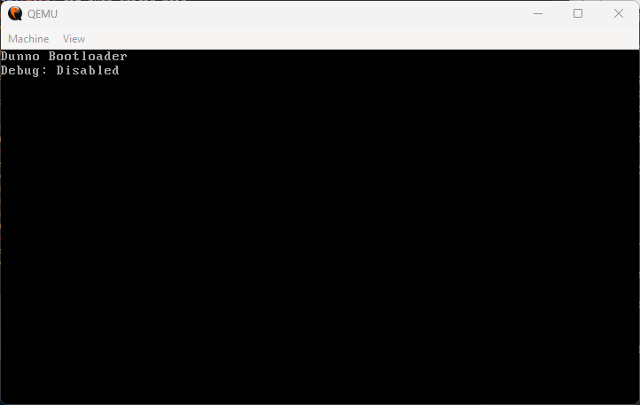

Title: DunnOS - Building my own OS
Date: 2022-11-28
Category: Engineer life

I believe that every single developer has thought about building
their OS. At least a Linux distro, or maybe their 
programming language.

Taking the first step is hard. You may have had a few lessons on assembly
and how computers work in college (if you went on one), but it is hard to
put this knowledge into practice in the modern tech industry.

## Doing to learn
It has been nice to do stuff just because I want to. My only goal
is learning. And I have made some pretty cool stuff since I started to 
learn more low-level stuff.

- I made a lisp programming language to sum numbers using LLVM 😂 
    - <a href="https://github.com/carlosmaniero/mars" target="_blank">Repository</a>
    - <a href="https://github.com/carlosmaniero/mars/blob/main/demo/sum.mars" target="_blank">Example</a>
- I wrote a lightweight unit-test tool for assembly:
    - <a href="https://github.com/carlosmaniero/assembly-study" target="_blank">Repository</a>
    
None of these projects went too far. But who cares! I learned a lot on the 
way. And I really recommend you to do stuff just because you would like
to understand how they work.

## Why an OS?

In terms of open-source, there is no doubt that Linux is a work of art, and
I've no idea how it works under the hood. All I know is that a bootloader
such as GRUB loads the operating system, but that is all I know...
better to say that *was* all I know.

I intend to make a few small posts documenting my progress. For now, All
I have is a simple bootloader using BIOS Legacy Boot. It is so beautiful!

For know you can follow the progress 
<a href="https://github.com/carlosmaniero/dunnos" target="_blank">here</a>.
